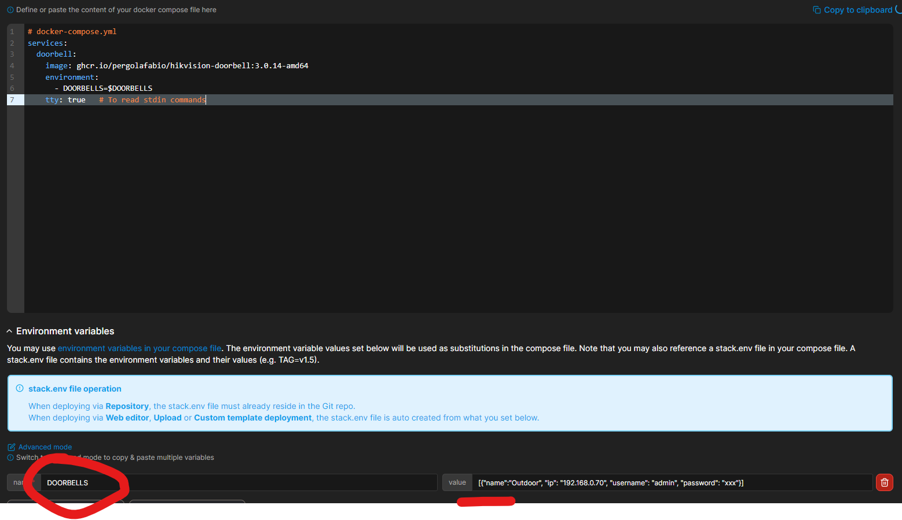

# Running the add-on as a standalone container

This program can run as a standalone Docker container, for all other type of installations. (Openhab, Home Assistant Container, ...)

## Docker Compose

If you use Docker Compose, a sample `docker-compose.yml` file might look like the following:

```yaml
# docker-compose.yml
version: "3.8"

services:
  doorbell:
    image: ghcr.io/pergolafabio/hikvision-doorbell:3.0.18-amd64
    # OR if you are using an RPI
    # image: ghcr.io/pergolafabio/hikvision-doorbell:3.0.18-aarch64
    env_file:
      - development.env
    tty: true   # To read stdin commands
```

The contents of the `development.env` should look like:
```yaml
# JSON string with the list of doorbells or indoor stations, for all options, have a look at the [docs](https://github.com/pergolafabio/Hikvision-Addons/blob/main/doorbell/DOCS.md)
DOORBELLS=[{"name":"Outdoor", "ip": "192.168.0.70", "username": "admin", "password": "xxx"},{"name":"Indoor", "ip": "192.168.0.71", "username": "admin", "password": "xxx"}]

# Connection to MQTT broker
MQTT__HOST=192.168.0.17
#MQTT__PORT=1883
MQTT__USERNAME=admin
MQTT__PASSWORD=xxx

# Help diagnose problems during development
SYSTEM__LOG_LEVEL=INFO
SYSTEM__SDK_LOG_LEVEL=NONE

# Load C native libraries required by the Hikvision SDK. Use the correct folder depending on you architecture.
LD_LIBRARY_PATH=lib-amd64/
# Or
# LD_LIBRARY_PATH=lib-aarch64/


# Enable python module to get stacktraces from C native calls in the SDK
PYTHONFAULTHANDLER=true
```

## Dockerhub

The image is available to download from Dockerhub, the configuration values are read from the environment variables, see an example screenshot from Synology Docker or Portainer

https://hub.docker.com/r/pergolafabio/hikvision-doorbell




## Manually building and running the container

To manually build and run the container, run the following from the `hikvision-doorbell` folder (dev branch):

- Build the image, specifying your architecture.
For instance:
```bash
docker build --build-arg=BUILD_ARCH=amd64 -t hikvision-doorbell .
```

- Run a container from the built image (remember to set the required environment variables, see above for details)
```bash
docker run -e MQTT__HOST=mosquitto hikvision-doorbell
```


## Configuration
If no configuration is provided, the container uses the values from the `default_config.yaml` file present in this repository (dev branch).

The application uses [Goodconf](https://github.com/lincolnloop/goodconf) to manage its configuration.
The configuration values are read from the environment variables or from a JSON/YAML file.
If a custom configuration file is available, you can define the env variable `CONFIG_FILE_PATH` pointing to its location.

You can override a single configuration option via its corresponding environment variable. For instance by exporting the env variable `SYSTEM__LOG_LEVEL=DEBUG`.
