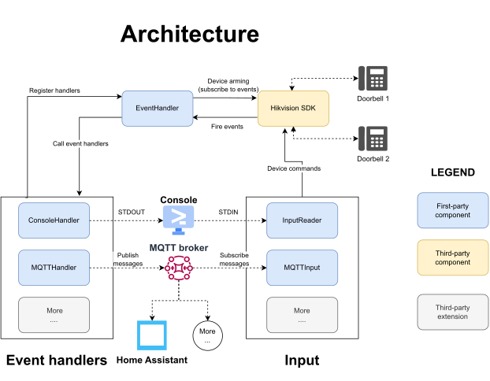

# Development guide

The current setup only works for x86/x64 system due to the HikVision SDK native libraries used, and has been tested on a Linux OS (Linux Mint).

## Requirements

- Python 3.10
- (optional) A fresh [virtualenv](https://docs.python.org/3/library/venv.html) for this project

## Instructions
After having cloned the repository, run the following commands from the `hikvision-doorbell` directory.

- Install the required packages
```bash
sudo apt update
sudo apt install python3.10-venv python3.10-dev
cd ~/Hikvision-Addons/hikvision-doorbell
python3.10 -m venv venv310
source venv310/bin/activate
pip install -r requirements.txt
deactivate
```

- Export the required environment variables to configure the software (see `development.env.example` for reference)
```bash
export DOORBELLS='[{"name":"outdoor", "ip": "192.168.0.1", "username": "user", "password": "password"}]'
export HOME_ASSISTANT__URL=http://localhost:8123
export HOME_ASSISTANT__TOKEN=<secret_token>
```

- Launch the application
```bash
python src/main.py
```

## VSCode

- If using VSCode, there is a run configuration already provided.
    
    First create a `development.env` file with your own values, then run the application using the integrated VSCode debugger.
    ```bash
    cp development.env.example development.env
    ```
- Run the application using the integrated VSCode runner (under `Run and Debug`).

## Testing the addon locally (VSCode devcontainer)
For more information see the official HA [guide](https://developers.home-assistant.io/docs/add-ons/testing).

Inside the _devcontainer_ use the task `Start Home Assistant` to bootstrap the HA supervisor, who will then proceed to locally install HA.

The local instance is accessible under `http://localhost:7123/`.

The addon should be visible in the add-on store.

## Internals

The following diagrams provides an high-level overview of the internal software architecture.
Third-party extension can be easily added by interfacing with the external **MQTT broker**.
If a more fine-grained approach is required, it is possible to manually implement new **event** and/or **input** handlers.

<p align="center">
    
</p>


## New releases

The release process is automated using Github Actions.
See the [workflow file](/.github/workflows/deploy.yml) for the definition of the automated steps.

The manual steps to publish a new release are as follows:
1. `git checkout` the branch containing the release code
2. Update the `CHANGELOG.md` file as appropriate 
   
   Update the `config.yaml`->`version` to point to the new version
3. `git commit` the changes
3. `git tag` using the format `<name of the addon>-<version number>`
    
    e.g: `git tag doorbell-v3.0.0` to release version `3.0.0` of the addon `doorbell`
4. `git push --tags` to push the tags to the repository and start the automatic release process

