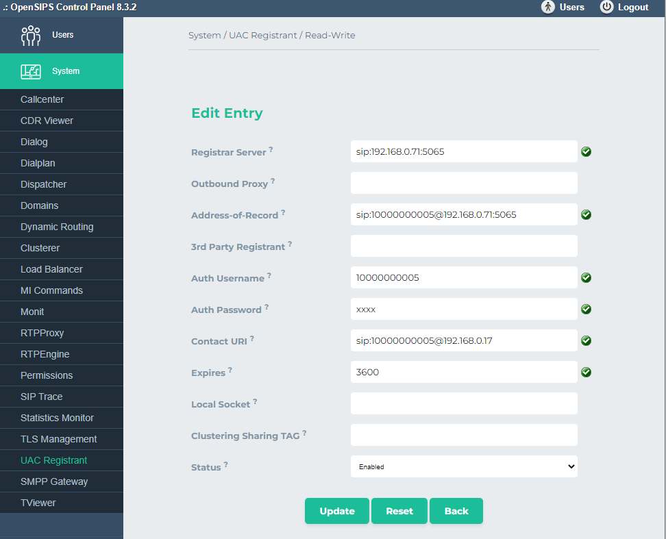
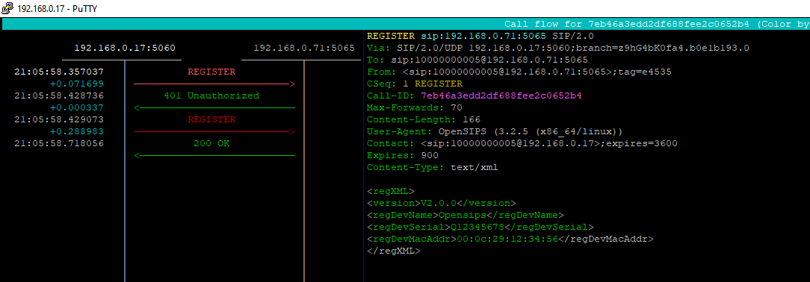
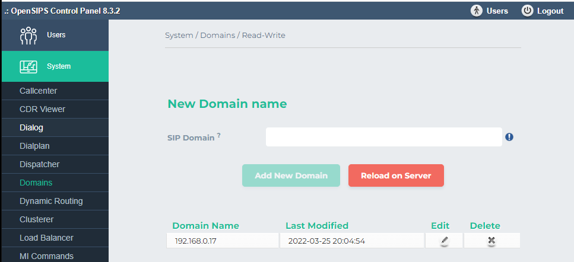
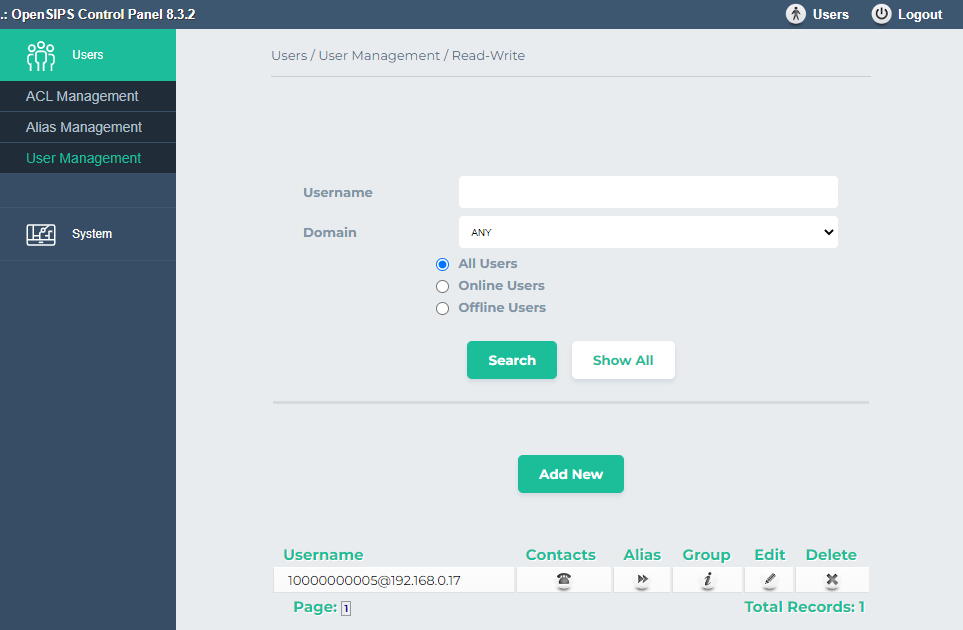

# Home Assistant Add-on: Register Openips/PBX as extension on your indoor panel

## Background info:

Indoor/Outdoor stations have also the possibility to register on a PBX like Asterisk/FreePBX..., BUT!!!

- When PBX is down => you miss the call :-)
- When connected to a PBX , Hikconnect cloud doesnt work anymore
- No video before pickup anymore on the indoor panels, so you dont see who is calling, quite annoying!!

## So why this addon?
- This addon is based on Opensips PBX, it can register as an extension on your primary indoor station, by modifying the REGISTER header... Opensips has the ability to send custom XML headers, needed to register on the private SIP protoclol present on the hikvision hardware

Advantages:

- Hikconnect cloud, still works!
- Still video on your indoor panels
- If this addon is down, the intercom still works as we register it as an extension
- You dont need access to the outdoor station, usefull for people living in appartment with no access to outdoor station.
- You dont need to use the Hikconnect app anymore, you can use your own softphone
- All local
- Verry nice intergations possible, you can even pickup/answer the call with a Lovelace SIP card!! Freaking nice! :-)  More info below (asterisk)
- It will provide you call sensors, more info below... (asterisk)
- Opening door also works by sending '#' during call with a softphone

Issues/Todo list 

- For some reason there is no video yet on the softphone, need to investigate this later, but you can use apps like Bas-IP, divus videophone, vfone, they have the possibility to inject RTSP, or just use the HA SIP card and use the camera entity :-)
- Hangup/Decline doesnt do its job, only when using Asteriks as a trunk, more info below

## Install guide, read carefully!

For this addon, you need to install first the MariaDB, its used to store the config: https://github.com/home-assistant/addons/tree/master/mariadb
After installing the MariaDB add-on, create a database and user/pass like below:

```
databases:
  - opensips
logins:
  - password: opensipsrw
    username: opensips
rights:
  - database: opensips
    username: opensips
```

As I told before, this addon registers on the indoor station, you need to add it first manually with the IVMS software, make sure you input the correct data, sice its now hardcoded in this Add-on:

For serial use: Q12345678, for No: 5, enter "Admin" password, the the IP is your HA instance... I used 5, because maybe there al already users with 4 indoor stations, so this will be the 5th :-)


Install my addon, use this link as a custom repository for your Addons : https://github.com/pergolafabio/Hikvision-Addons
Now, start this Add-on, ... Whats next not there yet.. :-)  Opensips povides an control panel, access it it by surfing to : http://homeassistant:5051/cp/ with credentials admin/opensips

Goto system, UAC Registant, add a new one with the correct info, in my example, 192.168.0.17 is HA, while 192.168.0.71 is my indoor panel:
- Registrar server: sip:192.168.0.71:5065
- Address of record: sip:10000000005@192.168.0.71:5065
- Auth username: 10000000005
- Auth password: the "admin" / "Registration" password of your device
- Contact URI: sip:10000000005@192.168.0.17
- Expires: 3600
- Status: enabled
- Leave the rest blanc
Add it, do a reload... if al goes well, after several minutes, you should see in IVMS the extension as "Registered" :-)




In the Add-on i included an utility called "SNGREP", verry usefull for troubleshooting and inspect the SIP traces, i suggest you launch it, so you can see what its doing on the background. You can acces the Add-on with this command in the SSH Add-on: `docker exec -it addon_a53439b8_hikvision_opensips /bin/bash` , when you are in, just launch "sngrep"....  OR just use the SSH addon, and install the tool there with this command "apk add sngrep" , then you cant restart opensips, while "sngrep" is still active.




Now, goto the section "Domains", add new domain and put in the IP address of your HA instance, after adding the domain, goto the users section, add a new user:
Username: 10000000005, the password you can choose here...
Important! Do a restart of the add-on, that will activate the user...



Thats it, this is the basic configuration! You can now install a softphone, try to register it, both TCP and UDP are enabled... when its successfull registered, press the call button, and if all goes well, the softphone should ring too!
Calling from indoor panels to softphone doesnt work, the softphone does ring, you can also pick up, but the call is terminated after pickup, no idea why, but i dont care...

Visit the opensips webpages, you can make rules/dialplans.... add new users... 

Thats it!!!!


Now the FUN part, below is optional, but VERRY nice... 

For the integration in HA, if you want to pickup the call with the HA Compantion app, or if you use tablets with HA on it, and you want to receive calls on it...
First of all, install the Asterisk-Addon : https://github.com/TECH7Fox/asterisk-hass-addons
Be carefull, Opensips runs on 5060 , Asterisk also runs on 5060, make sure you change it!!!!! See example below:

```
[transport-udp]
type = transport
protocol = udp
bind = 0.0.0.0:5050
local_net=192.168.0.0/24
local_net=10.8.0.0/24

[transport-tcp]
type=transport
protocol=tcp
bind=0.0.0.0:5050
local_net=192.168.0.0/24
local_net=10.8.0.0/24
```
Setup a trunk like below, this trunk with the info below, choose the same password you entered when creating an user on the Opensips, it will use that one...

```
[mytrunk]
type=registration
outbound_auth=mytrunk
server_uri=sip:192.168.0.17
client_uri=sip:10000000005@192.168.0.17
retry_interval=30
 
[mytrunk]
type=auth
auth_type=userpass
password=XXXXXXXXXX
username=10000000005
 
[mytrunk]
type=aor
contact=sip:192.168.0.17:5060
qualify_frequency=300
 
[mytrunk]
type=endpoint
context=default
disallow=all
allow=ulaw,alaw
allow=h264
outbound_auth=mytrunk
aors=mytrunk
 
[mytrunk]
type=identify
endpoint=mytrunk
match=192.168.0.17
```

Now create a dialplan, an easy example below:

```
exten => s,1,Set(DIALGROUP(mygroup,add)=PJSIP/100)
exten => s,n,Dial(${DIALGROUP(mygroup)},60)
```

This will call extension 100 :-)

Install this nice SIP Lovelace card, it will automaticly add persons with users 100, 101, ....
https://github.com/TECH7Fox/sip-hass-card

If you want call sensors and services, use this: https://github.com/TECH7Fox/asterisk-hass-integration

Have fun!
